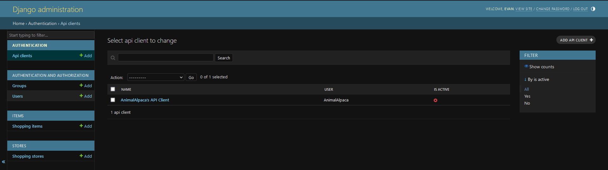

# Resetting API Clients

The ShoppingListApp offers an API that lets users integrate with the platform in any way they choose—whether it’s building a CLI, a web app, or something else entirely. To interact with the API, users need an API key. However, sometimes API keys can be lost, compromised, or need to be reset.

Below, we’ll walk through how an admin can reset an API client to allow a user to generate a new API key. **Note**: Users have some steps to follow before this process, which will be detailed in the API guides.

## Resetting the API Client via the Admin Page

To reset a user’s API access, follow these steps:

In the screenshot above, you’ll see that the user/client is marked as "inactive." This status usually means the user has reported their API key as compromised or lost, and they want to generate a new one to regain access to the API.

### Steps to Reset the API Client:

1. **Verify the client's status**: Confirm that the client is indeed inactive, indicating they’ve requested a reset due to a compromised key.
   
2. **Delete the existing API client**: This is as simple as clicking the delete button. Once the API client has been deleted, the user will no longer be able to access the API with their old key.

3. **User recreates the API key**: Once the client has been deleted, the user can follow the process to generate a new API key and regain access to the API.

That’s it! Deleting the API client is the main step you need to take, and the user will be able to recreate a new token and continue using the APIs.
