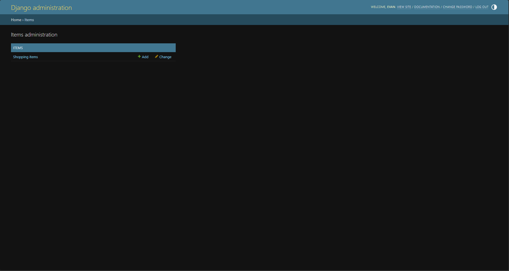
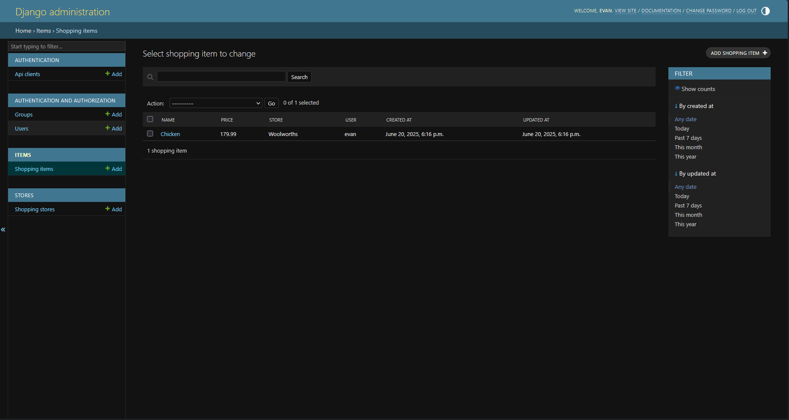
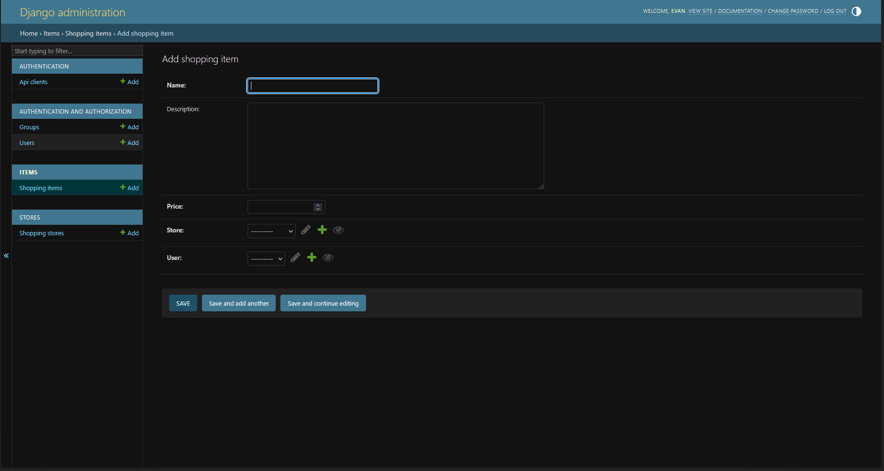
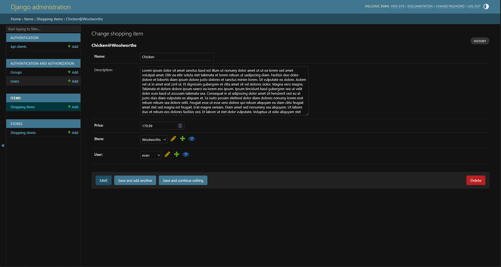

# Items Administration

The **Items** section of the Django admin lets staff users create, view and maintain every `ShoppingItem` in the database.  It is especially useful for quick data entry or for fixing data problems discovered.

## Accessing the section

1. Sign in to the Django admin (usually available at `/admin/`).
2. In the left-hand navigation open **Items › Shopping items**.

The central panel now lists every shopping item currently stored.

## List view

The list view shows one row per `ShoppingItem`.  The columns are:

| Column       | Description                                   |
|--------------|-----------------------------------------------|
| **Name**     | Item name (unique per store).                 |
| **Price**    | Unit price stored as a decimal.               |
| **Store**    | The store where the item can be purchased.    |
| **User**     | The user who originally created the record.   |
| **Created at** | Timestamp of the initial creation.           |
| **Updated at** | Timestamp of the last change.                |

### Searching

Use the search bar above the table to look up items by **name** or by any text contained in the **description** field.

### Filtering

The right-hand sidebar provides powerful filters:

* By **created at** – Today, past 7 days, this month or year.
* By **updated at** – Same date presets as above.
* By **store** and **user** – These appear automatically once more than one store or user exists in the database.

### Bulk actions

Tick the checkboxes next to one or more rows, choose an **Action** (e.g. *Delete selected shopping items*) and press **Go**.

## Adding a shopping item

1. Click the **Add shopping item ➕** button in the top-right corner of the list view or the **+ Add** link in the sidebar.
2. Fill in the form fields:
    1. **Name** – Required; unique within a store.
    2. **Description** – Optional free-text notes that will appear in detail views.
    3. **Price** – Decimal value; no currency symbol.
    4. **Store** – Pick an existing `ShoppingStore` from the drop-down.  The ✏️, ➕ and 👁️ icons let you **edit**, **create** or **preview** a store without leaving the form.
    5. **User** – Defaults to the current admin; change it if you are entering data on behalf of someone else.  The same trio of icons (edit / add / preview) is available.
3. At the bottom you have three save options:
    1. **Save** – Create the record and return to the list.
    2. **Save and add another** – Create the record and open a blank add form.
    3. **Save and continue editing** – Create the record and remain on the detail form for further changes.

If you attempt to save an item whose *name* already exists **for the same store**, Django will block the operation and display a validation error – this rule is enforced at both the model and database level.

## Editing an item

Click an item's name in the list to open the change form.  The interface is identical to the add form, with a few extras:

* A **History** button (top-right) shows every modification ever made to the record.
* A **Delete** button (bottom-right) permanently removes the item after confirmation.

After making your changes press **Save** (or one of the alternative save buttons).  The **updated at** timestamp is refreshed automatically.

## Deleting an item

Open the item and click **Delete**, or use the bulk-action menu in the list view.  You will be asked for confirmation because deletion is permanent.
