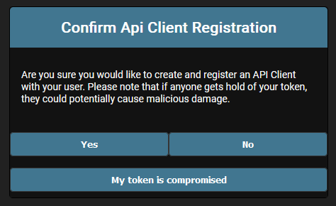

# Creating your token

To consume the API, you will require a token.

This token you can create by navigating to the token url: <host>/token

You will be shown this page:

If you click on yes, you will be provided a token you can use to access the API.

## Your token is compromised and needs to be revoked

You can visit the same page and click on the button that says: `My token is compromised`

This will disable your token, to get a new token, you will first need someone with admin privileges to delete the existing record that exists in relation to your account. This is covered [here](../admin/index.md)

