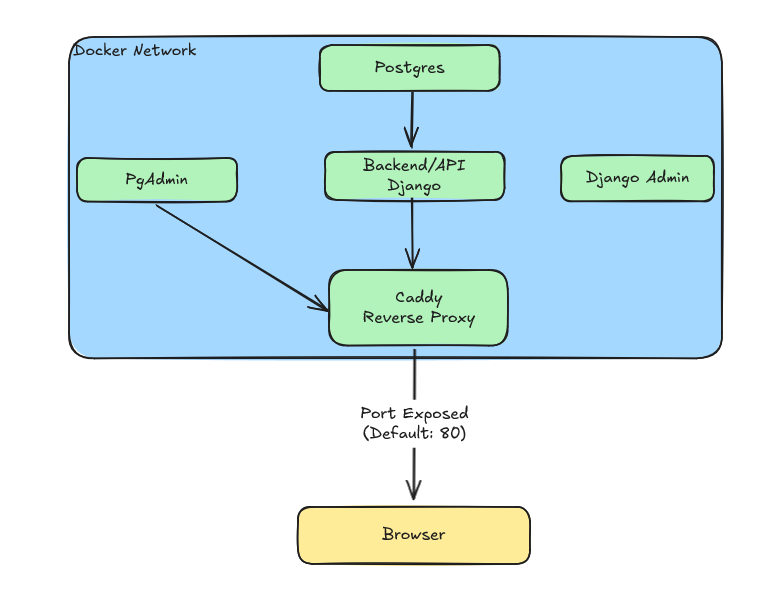

# Overview of architecture



## Components

- **Caddy** (Reverse Proxy)
- **Django Application** (Backend/API)
- **Postgres** (Database)
- **Django Admin Container**
- **PgAdmin**

### Caddy (Reverse Proxy)

The entry point for the ShoppingListApp, from a browser perspective, is the **Caddy container**. This container is based on the Caddy image and handles the majority of static file serving, along with forwarding requests to appropriate services based on URL paths.

#### Static Files

Caddy serves static assets, such as **CSS** and **JS** files, which include:

- Static files used by Django templates.
- Static files generated by the React dashboard.
- Any other required static files.

#### Reverse Proxy Setup

Caddy is also responsible for routing requests to different services within the architecture. Below is an example of the Caddyfile used in this setup:

```
:80 {
    # Proxy requests to the Django app
    handle_path /* {
        reverse_proxy shopping-django-app:80
    }

    # Proxy API requests from the React app to the Django app
    handle_path /apis/shopping/* {
        reverse_proxy shopping-django-app:80
    }

    # Serve static files required by the Django app
    handle_path /static/* {
        root * /var/www/html/static/
        file_server
    }

    # Serve static files for the React dashboard
    handle_path /shopping/dashboard/* {
        root * /var/www/html/site/
        file_server
    }

    # Proxy requests to PgAdmin
    handle_path /pgadmin* {
        rewrite * /pgadmin{uri}
        reverse_proxy shopping-pgadmin:80
    }
}
```

In summary, Caddy handles:

- Proxying requests to the Django app (including API requests from the React dashboard).
- Serving static files.
- Proxying requests to the PgAdmin interface.

### Django Application (Backend/API)

The **Django application** serves as the backend for the ShoppingListApp. It provides two main functions:

1. **Serving application content**: Using Django templates, the application dynamically renders and delivers web pages.
   
2. **Providing a REST API**: The app exposes an API that allows users to interact programmatically with their shopping lists, enabling the development of external tools such as CLIs or additional web apps.

We’ll explore the application’s functionality in more detail in a later section.

### Postgres (Database)

The **Postgres database** is the heart of data storage for the ShoppingListApp. It stores all shopping lists, users, items, and related data, ensuring that all information is safe and available for retrieval by the Django app.

### Django Admin Container

The **Django Admin Container** provides a convenient interface for running management commands (`manage.py`) directly from within the app’s environment. This is especially useful for tasks such as:

- **Creating superusers**: When setting up the application for the first time, admins can create superusers without needing to connect to the database manually.

This container helps avoid the need to use external tools or database clients to perform basic administrative functions.

### PgAdmin

**PgAdmin** is bundled with the app as a web-based database management tool for **Postgres**. While it’s not necessary for daily operations (as most management tasks can be handled via the app), PgAdmin can be useful for advanced database management and querying in rare situations.
