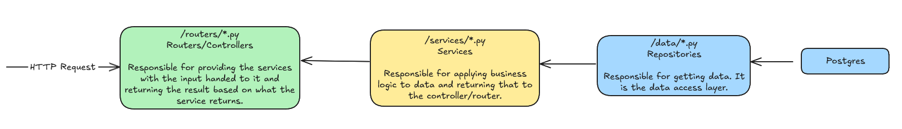
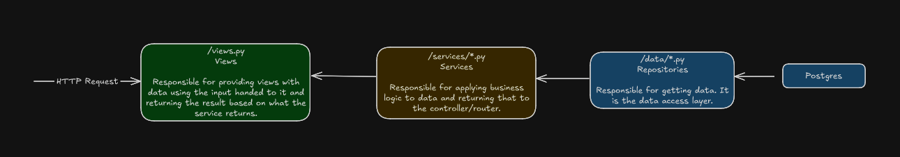

# App Structure

**NOTE: In this context, an app refers to a Django App, which is isolated piece of the project.**

I structure all of the apps using the same patterns. Not all components of this pattern are used everywhere, but they will very rarely deviate from the components that will be outlined below.

## Repositories, Services and Routers (API)

I split the apps into three main parts when developing API endpoints.

- Repositories
    - The data layer, responsibility is to get the data. Does not worry about business logic.
- Services
    - The business logic layer, uses the repositories to get the data, and then applies the necessary logic to that data.
- Routers
    - Utilizes the services, and is responsible for returning the result and is the entry point.

## Views

Similiar to the above, we have services and repositories for the views.

