# Getting Started with Shopping List App

## Logging in

When you first open the **Shopping List App**, you’ll be greeted by the following page:

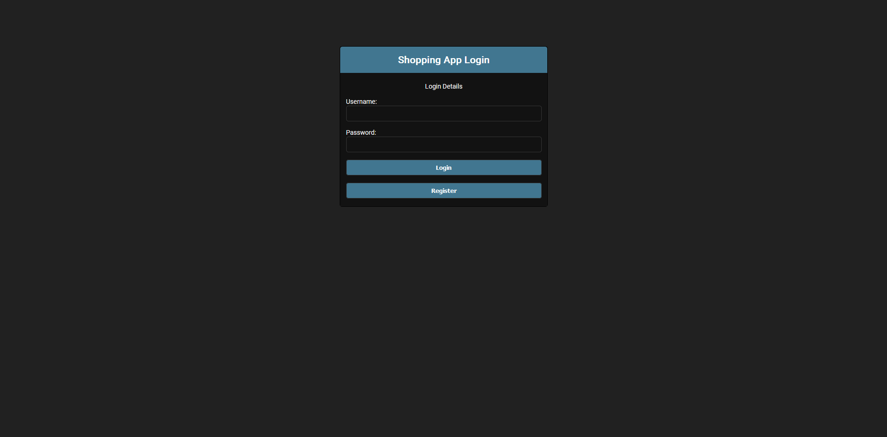

If you already have an account, you can log in here using your **username** and password. Please note that your **email** is **not** a valid username. During the account creation process, you chose a username, and that’s what you’ll use to log in.

### Registering

If you don’t have an account yet, click the **Register** button to head to the registration page:

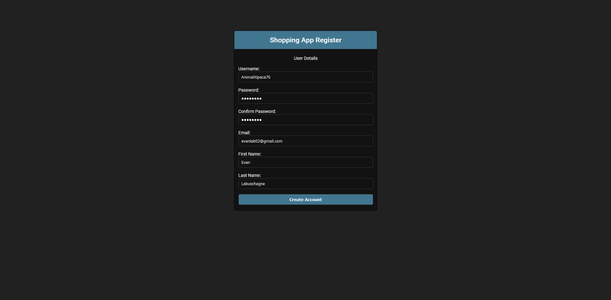

Once you’re ready, fill out the necessary information and click on **Create Account**. After that, you can proceed to log in with your new credentials. 

## The dashboard

Once logged in, you will see the dashboard:

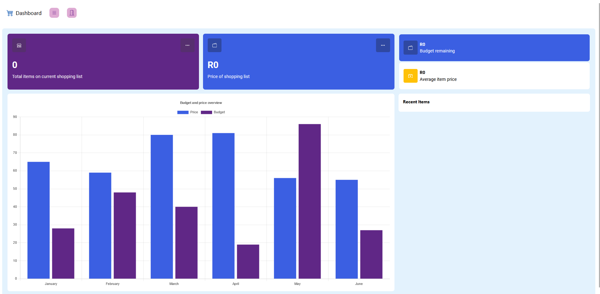

**NOTE: This page is still under construction, we will add more info here in future.**

### Total items

**COMING SOON**

### Price of shopping list

**COMING SOON**

### Budget remaining

**COMING SOON**

### Average item price

**COMING SOON**

### History Chart

**COMING SOON**

### Recent items

**COMING SOON**

## Items

To view all the items you have created you can click on the Shop Icon within the purple card on the dashboard page:

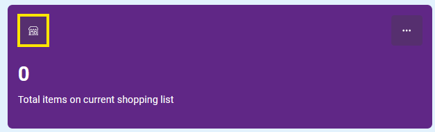

You can also click on the 3 dots icon, and a dialog will open, which will have a button that will allow you to view your items.

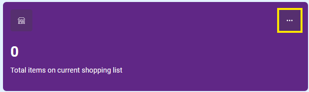

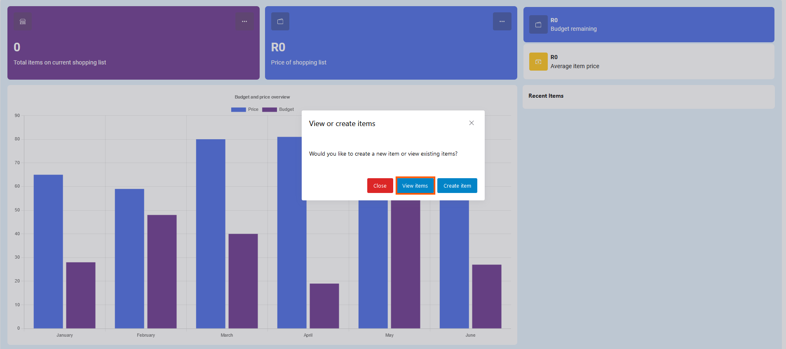

### Items Page

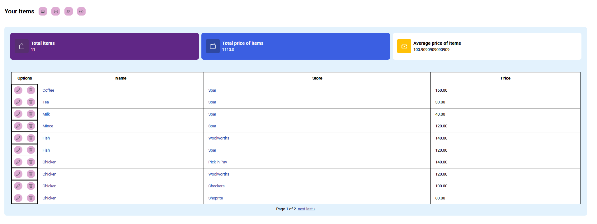

On this page you can view all the items you created, you will also be able to navigate to their detail, edit or delete pages. You can also access the detail page of each store where you can view all the items of a store and the details about the store.

**NOTE: All items can be used by other users but only you can edit/delete them.**

You are also able to access the page where you view all items that have been created by all users by clicking on the button highlighted in the below screenshot:

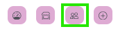

**NOTE: This button will allow you to switch back and forth between your items page and the all items page.**

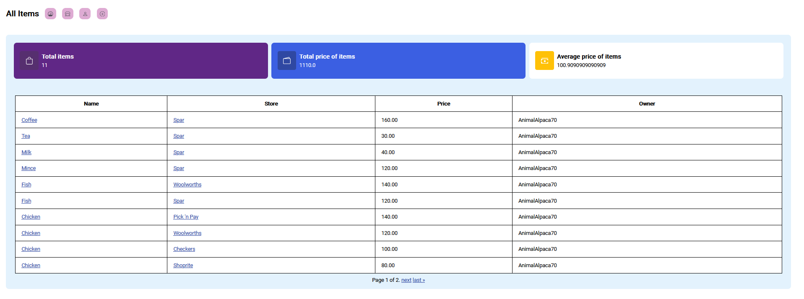

### Create Item

To create an item, from the items pages, you can click on plus-circle button to go to item creation page. Highlighted in the below screenshot:

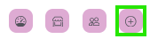

Once you are on the item creation page, you will need to fill in the following details:

- Item Name
- Store item belongs to
- The price
- And optionally, the description of the item.

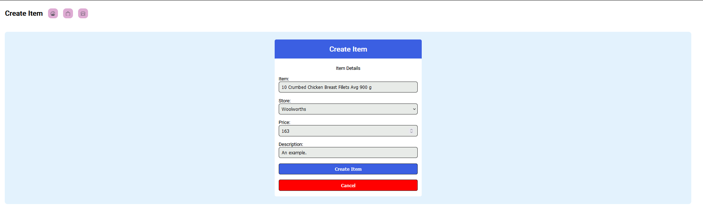

And then you can create your item.

### Item detail page

After you create an item, you will be taken to its detail page.

**NOTE: You can also get to the detail page by clicking on the name of the item from the item list view/page.**

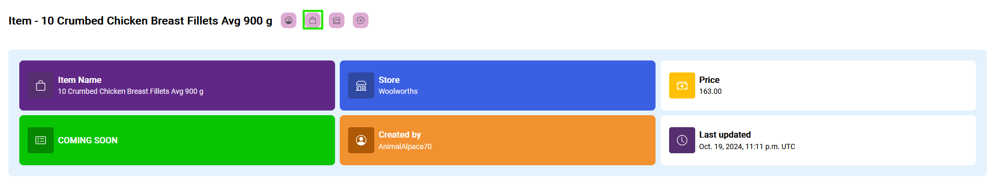

Here you can view all the details of the item, at this stage there is not much to see here.

In future, one of the cards will display the number of shopping lists this item is on but further than that, this is a very basic page.

To go back to the item list view/page, click on the little bag icon in the navigation bar.

### Edit item page

To edit an item, you can click on the pencil icon within the table for the specific item you want to update.

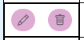

When you arrive on the update page, you will notice some of the fields have placeholders. These placeholders will be the previous values which were on the item, you can leave any of these fields blank and it will not update that field for the item (Meaning it will stay the same as is in the placeholder).

In the example below, I have updated one of my items "Coffee" to have a different price but keep everything else the same.

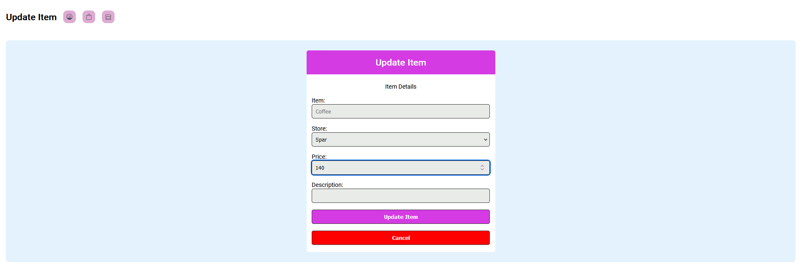

Now in the list view, we will see the new price of the item.

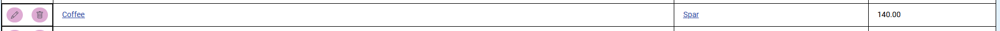

### Delete item page

Now to delete an item, you can click on the bin icon within the table for the specific item you want to delete.

Once you are on the delete page, you can click the "Delete item" button and it will delete this item/record.

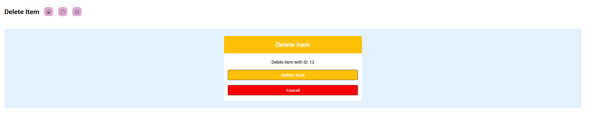
