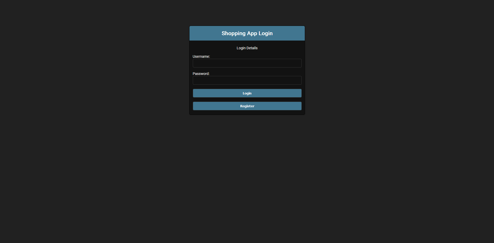
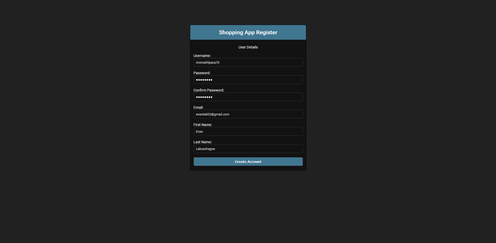

# Logging into the Shopping List App

When you first open the **Shopping List App**, you’ll be greeted by the following page:

If you already have an account, you can log in here using your **username** and password. Please note that your **email** is **not** a valid username. During the account creation process, you chose a username, and that’s what you’ll use to log in.

## Registering

If you don’t have an account yet, click the **Register** button to head to the registration page:

Once you’re ready, fill out the necessary information and click on **Create Account**. After that, you can proceed to log in with your new credentials. 
