# Getting Started with Shopping List App

## Logging in

When you first open the **Shopping List App**, you’ll be greeted by the following page:

If you already have an account, you can log in here using your **username** and password. Please note that your **email** is **not** a valid username. During the account creation process, you chose a username, and that’s what you’ll use to log in.

### Registering

If you don’t have an account yet, click the **Register** button to head to the registration page:

Once you’re ready, fill out the necessary information and click on **Create Account**. After that, you can proceed to log in with your new credentials. 

## The dashboard

Once logged in, you will see the dashboard:

**NOTE: This page is still under construction, we will add more info here in future.**

### Total items

**COMING SOON**

### Price of shopping list

**COMING SOON**

### Budget remaining

**COMING SOON**

### Average item price

**COMING SOON**

### History Chart

**COMING SOON**

### Recent items

**COMING SOON**

## Items

To view all the items you have created you can click on the Shop Icon within the purple card on the dashboard page:

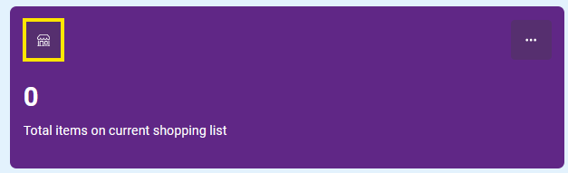

You can also click on the 3 dots icon, and a dialog will open, which will have a button that will allow you to view your items.

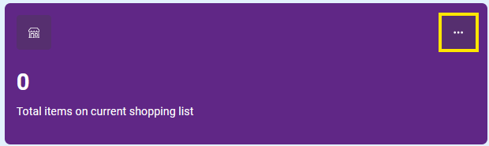

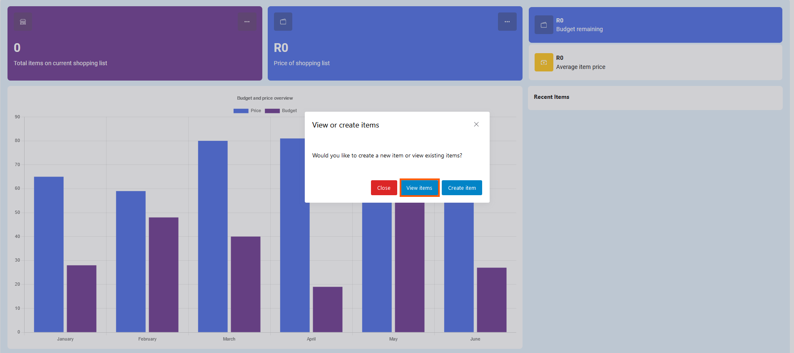

### Items Page

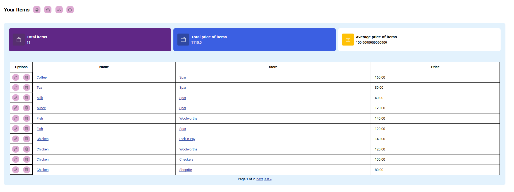

This page shows all the items you've created, and you can navigate to their details, edit, or delete them from here. You can also access the store details to view all items in that store and the store info.

**Heads-up: While other users can use the items you add, only you have the power to edit or delete them.**

Want to see everyone's items? No problem! You can access the page to view items created by all users by clicking the highlighted button in the screenshot below:

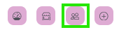

**Note: The button lets you switch back and forth between your personal items and all items.**

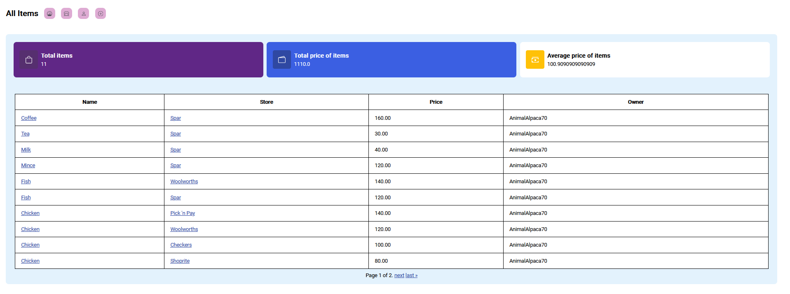

### Create Item

To create an item, click the plus-circle button on the items page. Here’s what it looks like:

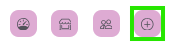

On the item creation page, fill in the following details:

- Item Name
- Store it belongs to
- Price
- Optionally, add a description.

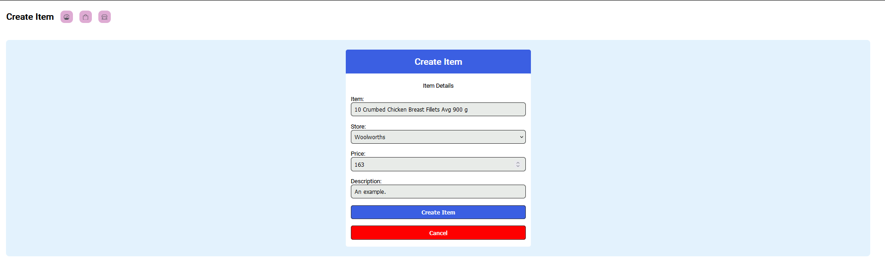

And boom—item created!

### Item detail page

After creating an item, you’ll be taken to its detail page.

**Pro Tip: You can also get to the detail page by clicking on the item’s name in the list view.**

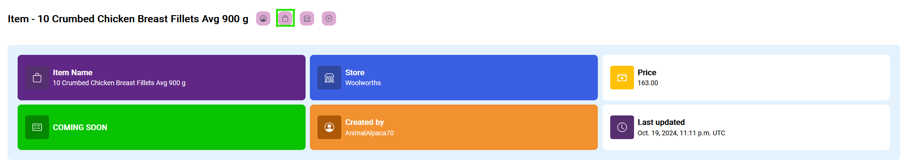

For now, it’s pretty straightforward. You can see the item’s info. Later, one of these cards will show how many shopping lists this item appears on, but for now, we’re keeping things simple.

To get back to the item list page, click the little bag icon in the navigation bar.

### Edit item page

Need to update an item? Click the pencil icon next to the item you want to change.

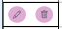

On the update page, you’ll notice placeholders in the fields. These show the current values. Leave any fields blank if you don’t want to change them.

In this example, I updated the price of my item "Coffee" but left everything else the same:

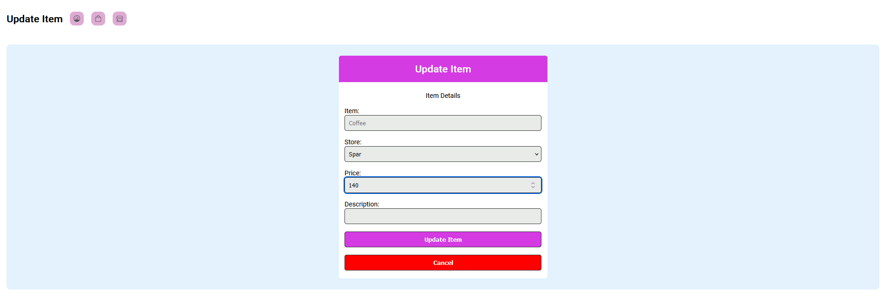

Now, when we go back to the list view, we can see the updated price:

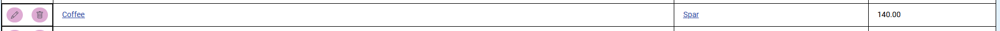

### Delete item page

To delete an item, click the bin icon next to the item you want to remove.

On the delete page, just hit the "Delete item" button, and it’s gone!

