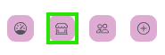
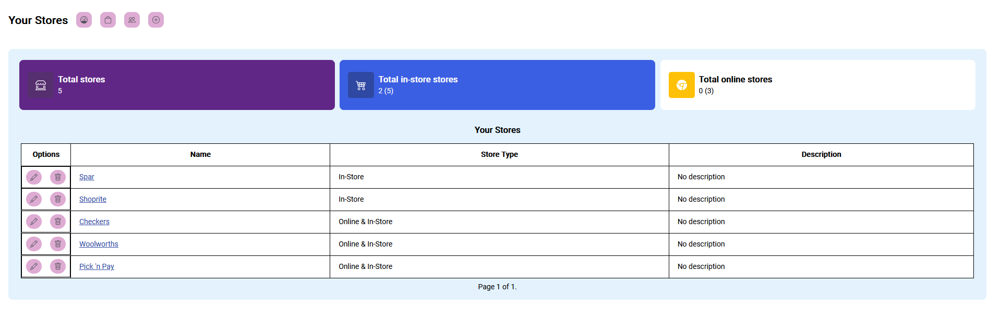
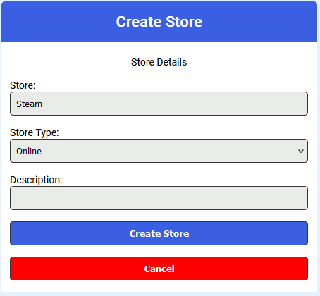
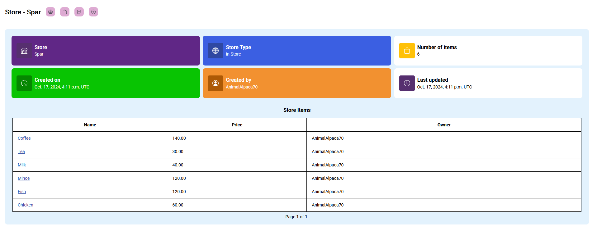
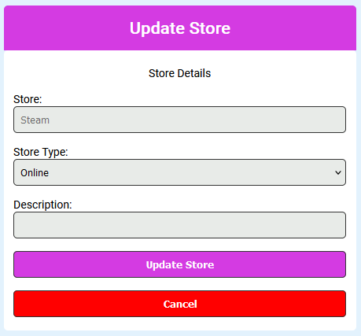
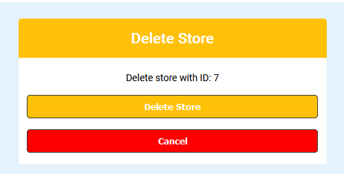

# Stores

To view all the stores that you have created, you can click on the shop icon from the items page:

## Stores page

This page shows all the stores you've created, and you can navigate to their details, edit, or delete them from here. You can access the store details to view all items in that store and the store info.

**Heads-up: While other users can use the stores you add, only you have the power to edit or delete them.**

You can switch to the all stores page the same way you would as for the items page.

## Create a store

You can click on the plus button in the navigation to create a store from the stores page.

On the store creation page, fill in the following details:

- Store Name
- The type of store (Online/In-Store/Both)
- Optionally, add a description.

## Store detail page

After creating a store, you will be redirected to the store detail page.

Here you can view all sorts of info about the store, and view all the items that belong to that store.

## Store edit page

You can navigate to the store update page from the stores list page.

You can click on the pencil icon to edit it:

On the update page, you’ll notice placeholders in the fields. These show the current values. Leave any fields blank if you don’t want to change them.

## Delete store page

To delete an store, click the bin icon next to the store you want to remove.

On the delete page, just hit the "Delete item" button, and it’s gone!

